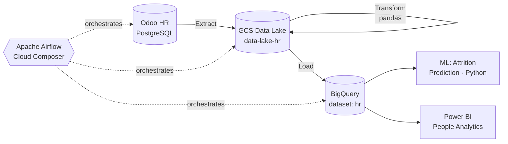
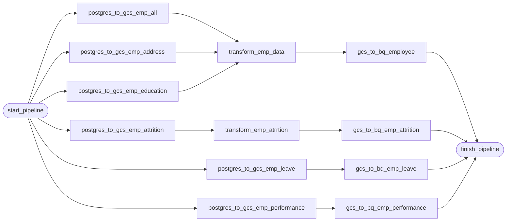

# HR Data Pipeline & People Analytics

> 🎓 Independent Study (IS) · M.Sc. Artificial Intelligence for Business Analytics, KMITL
> 📝 Full write-up (Thai): **[พัฒนา Data Pipeline และ People Analytics สำหรับ HR](https://medium.com/@surasak.chantarach/%E0%B8%9E%E0%B8%B1%E0%B8%92%E0%B8%99%E0%B8%B2-data-pipeline-%E0%B9%81%E0%B8%A5%E0%B8%B0-people-analytics-%E0%B8%AA%E0%B8%B3%E0%B8%AB%E0%B8%A3%E0%B8%B1%E0%B8%9A-hr-0efad6c503f8)**


An end-to-end HR analytics platform. Employee data moves from an HRIS (**Odoo HR on PostgreSQL**) into a **Google Cloud Storage** data lake and a **BigQuery** data warehouse. **Apache Airflow (Cloud Composer)** orchestrates each step. The warehouse feeds an **attrition-prediction model** and **Power BI** People Analytics dashboards.

---

## 🏗️ Architecture



---

## 🔄 Airflow DAG — `load_postgres_to_gcs_bq`

The DAG is in [`dags/load_postgres_to_gcs_bq.py`](dags/load_postgres_to_gcs_bq.py). It runs **4 ETL pipelines in parallel**:



| # | Pipeline | Source table(s) → BigQuery table | Transform |
|---|---|---|---|
| 1 | Employee master | `employee_all` + `employee_address` + `employee_education` → `hr.employee` | Selects the key columns and left-joins the three tables on `x_emp_id` (pandas) |
| 2 | Attrition | `employee_attrition` → `hr.employee_attrition` | Placeholder step |
| 3 | Leave | `employee_leave` → `hr.employee_leave` | — |
| 4 | Performance | `employee_performance_rating` → `hr.employee_performance_rating` | — |

**Key operators:** `PostgresToGCSOperator` · `PythonOperator` · `GCSToBigQueryOperator` (`WRITE_TRUNCATE`, schema autodetect)
**Schedule:** `@hourly` · retries: 5 (every 5 min)

---

## 🤖 Attrition Prediction & Insights

- Reduced 34 features to 20 key predictors
- Compared **Logistic Regression, Decision Tree, Random Forest, SVM, KNN, Neural Network**
- Dashboard highlights: 1,470 employees · 237 attritions (**~16% attrition rate**) · breakdowns by department, demographics and commute distance

---

## ⚙️ How to Run

1. Set up Airflow 2.x (or Cloud Composer) with the Google and Postgres providers:
   ```bash
   pip install -r requirements.txt
   ```
2. Create two Airflow connections:
   - `postgres_default` → the Odoo HR PostgreSQL database
   - `google_cloud_default` → a GCP service account with GCS and BigQuery access
3. Update the constants at the top of the DAG to match your environment: `GCP_PROJECT`, `GCS_BUCKET`, `GBQ_DS`
4. Copy `dags/load_postgres_to_gcs_bq.py` into your Airflow `dags/` folder, then trigger the DAG

---

## 📁 Repository Structure

```
hr-people-analytics-pipeline/
├── dags/
│   └── load_postgres_to_gcs_bq.py   # Airflow ETL DAG
├── requirements.txt
└── README.md
```

---

👤 **Surasak Chantarach** · [LinkedIn](https://linkedin.com/in/surasak-ch/) · [Medium](https://medium.com/@surasak.chantarach) · [GitHub](https://github.com/llexpertll)
